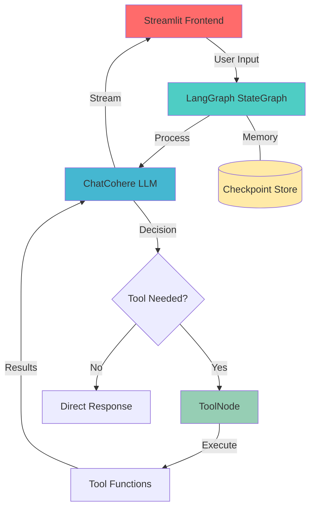

<div align="center">

# 🧠 SYNAPSE

### **A Modular AI Assistant with Tools, Memory, and Real-Time Streaming**

[](https://www.python.org/)
[](https://langchain-ai.github.io/langgraph/)
[](https://streamlit.io/)
[](LICENSE)

*Built with LangGraph, LangChain, and Cohere*

[Features](#-features) • [Architecture](#%EF%B8%8F-architecture) • [Installation](#%EF%B8%8F-setup) • [Usage](#-usage) • [Roadmap](#-roadmap)

---

</div>

## 📖 Overview

**SYNAPSE** is a graph-based AI assistant that combines the power of **LangGraph orchestration**, **tool-aware reasoning**, and **conversational memory** into a sleek Streamlit interface. Built for developers who want to create intelligent, context-aware chatbots with minimal friction.

### Why SYNAPSE?

- 🎯 **Modular Design** — Easy to extend with new tools and capabilities
- 🔄 **Graph-Based Reasoning** — Sophisticated agent orchestration using LangGraph
- 💾 **Conversational Memory** — Maintains context across multi-turn conversations
- ⚡ **Real-Time Streaming** — Token-by-token response generation
- 🛠️ **Tool Integration** — Web search, stock prices, and custom tools
- 🎨 **Clean UI** — Professional Streamlit interface with session management

---

## ✨ Features

<table>
<tr>
<td width="50%">

### 🤖 **AI Core**
- Graph-based agent orchestration with LangGraph
- Tool-enabled LLM (ChatCohere)
- Conditional tool execution & routing
- In-memory conversational state management

</td>
<td width="50%">

### 🎨 **User Experience**
- Streamlit-based chat interface
- Multi-threaded conversation switching
- Session state management
- Token-level streaming responses

</td>
</tr>
<tr>
<td width="50%">

### 🛠️ **Tools & Integrations**
- Web search (DuckDuckGo)
- Stock price lookup
- Structured data retrieval
- Extensible tool architecture

</td>
<td width="50%">

### 💾 **Memory & State**
- LangGraph checkpoint system
- Cross-session memory persistence
- Thread-based conversation management
- Context-aware responses

</td>
</tr>
</table>

---

## 🏗️ Architecture

SYNAPSE follows a clean, modular architecture that separates concerns for maximum flexibility:



### Component Breakdown

| Component | File | Responsibility |
|-----------|------|----------------|
| **Backend** | `Backend.py` | LangGraph state management, LLM orchestration, tool routing |
| **Frontend** | `Frontend.py` | Streamlit UI, conversation management, streaming display |
| **Tools** | `Tools.py` | Tool definitions, web search, stock prices, custom functions |

---

## 📂 Project Structure

```
synapse-ai/
│
├── 📄 Backend.py          # Core agent logic & graph orchestration
├── 🎨 Frontend.py         # Streamlit chat interface
├── 🛠️ Tools.py            # Tool definitions & implementations
├── 📋 requirements.txt    # Python dependencies
├── 🔐 .env.example        # Environment variable template
└── 📖 README.md           # Project documentation
```

---

## ⚙️ Setup

### Prerequisites

- **Python 3.8+**
- **Cohere API Key** ([Get one here](https://cohere.com/))

### 1️⃣ Clone the Repository

```bash
git clone https://github.com/Nabin68/SYNAPSE.git
cd SYNAPSE
```

### 2️⃣ Install Dependencies

```bash
pip install -r requirements.txt
```

**Required packages:**
```txt
langchain
langchain-cohere
langgraph
streamlit
python-dotenv
duckduckgo-search
yfinance
```

### 3️⃣ Configure Environment

Create a `.env` file in the project root:

```env
COHERE_API_KEY=your_cohere_api_key_here
```

> 💡 **Tip:** Copy `.env.example` to `.env` and fill in your API key

---

## 🚀 Usage

### Running the Application

```bash
streamlit run Frontend.py
```

The application will open in your default browser at `http://localhost:8501`

### Using the Chat Interface

1. **Start Chatting** — Type your message in the input box
2. **Watch Live Responses** — See the AI respond in real-time with streaming
3. **Switch Conversations** — Use the sidebar to create or switch between threads
4. **Tool Usage** — The AI automatically uses tools when needed (search, stock prices, etc.)

### Example Interactions

```
User: What's the current price of Apple stock?
🧠 SYNAPSE: [Uses stock price tool]
      The current price of AAPL is $195.83...

User: Search for the latest AI news
🧠 SYNAPSE: [Uses web search tool]
      Here are the latest developments in AI...
```

---

## 🛠️ Extending SYNAPSE

### Adding New Tools

Create a new tool in `Tools.py`:

```python
@tool
def my_custom_tool(query: str) -> str:
    """Description of what your tool does"""
    # Your implementation
    return result
```

Register it in the tool list:

```python
tools = [web_search, stock_price, my_custom_tool]
```

### Customizing the LLM

Modify `Backend.py` to use a different model or provider:

```python
from langchain_openai import ChatOpenAI

model = ChatOpenAI(model="gpt-4", temperature=0.7)
```

---

## 🔮 Roadmap

### Coming Soon

- [ ] 💾 **SQLite-based persistent memory** — Long-term conversation storage
- [ ] 📚 **RAG integration** — Document Q&A and knowledge retrieval
- [ ] 🔌 **MCP server support** — Model Context Protocol integration
- [ ] 🧰 **Extended tool library** — Weather, news, calculations, and more
- [ ] 🎨 **Theme customization** — Dark mode and custom color schemes
- [ ] 📊 **Analytics dashboard** — Conversation insights and usage stats
- [ ] 🌐 **Multi-language support** — Internationalization
- [ ] 🔒 **Authentication** — User accounts and access control

---

## 🤝 Contributing

Contributions are welcome! Here's how you can help:

1. **Fork** the repository
2. **Create** a feature branch (`git checkout -b feature/AmazingFeature`)
3. **Commit** your changes (`git commit -m 'Add some AmazingFeature'`)
4. **Push** to the branch (`git push origin feature/AmazingFeature`)
5. **Open** a Pull Request

### Development Guidelines

- Follow PEP 8 style guidelines
- Add docstrings to new functions
- Update README for new features
- Test thoroughly before submitting

---

## 📝 License

This project is licensed under the **MIT License** - see the [LICENSE](LICENSE) file for details.

---

## 👤 Author

**Nabin**

- GitHub: [@Nabin68](https://github.com/Nabin68)
- LinkedIn: [Nabin Rouniyar](https://www.linkedin.com/in/nabin-rouniyar-86682726a/)

---

## 🙏 Acknowledgments

- [LangChain](https://www.langchain.com/) — For the incredible LLM framework
- [LangGraph](https://langchain-ai.github.io/langgraph/) — For graph-based agent orchestration
- [Cohere](https://cohere.com/) — For powerful language models
- [Streamlit](https://streamlit.io/) — For the beautiful UI framework

---

## 📞 Support

If you encounter any issues or have questions:

- 🐛 [Open an issue](https://github.com/Nabin68/synapse-ai/issues)
- 💬 [Start a discussion](https://github.com/Nabin68/synapse-ai/discussions)
- 📧 Email: nabingupta68@gmail.com

---

<div align="center">

### ⭐ Star this repo if you find it helpful!

**Made with ❤️ by Nabin**

</div>
